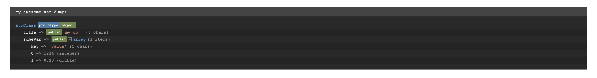

[](https://travis-ci.org/0m3gaC0d3/t3-debugger-utility-standalone)

# TYPO3 DebuggerUtility - Standalone
This library is for everybody who wants to use the DebuggerUtility of the well known CMS TYPO3 (v 9.5) in its own project.

The API of the class is still the same, so you dont have to learn a new one.

Its an education project to increase my skills as a developer, but may it will be useful for somebody.



## Installation
This library is composer based, so you simply have to execute the following command:

```bash
composer require omegacode/t3-debugger-utility-standalone
```

## Requirements

 * At least PHP version 7.1

## Usage

This is a simple example of how to use the class.

```php
require_once __DIR__.'/vendor/autoload.php';

$var = new stdClass();
$var->title = "my obj";
$var->someVar = [
  "key" => "value",
  1234,
  0.23
];

\OmegaCode\DebuggerUtility::var_dump($var, 'my awesome var_dump!');
```

For more advanced usages, check the API of the class

| Parameter                 | Description                                                                                                                               | Optional |
|---------------------------|-------------------------------------------------------------------------------------------------------------------------------------------|----------|
| $variable                 | The value to dump                                                                                                                         | no       |
| $title                    | optional custom title for the debug output                                                                                                | yes      |
| $maxDepth                 | Sets the max recursion depth of the dump. De- or increase the number according to your needs and memory limit.                            | yes      |
| $plainText                | if TRUE, the dump is in plain text, if FALSE the debug output is in HTML format                                                           | yes      |
| $ansiColors               | if TRUE (default), ANSI color codes is added to the output, if FALSE the debug output not colored                                         | yes      |
| $return                   | if TRUE, the dump is returned for custom post-processing (e.g. embed in custom HTML). If FALSE (default), the dump is directly displayed. | yes      |
| $blacklistedClassNames    | An array of class names (RegEx) to be filtered. Default is an array of some common class names.                                           | yes      |
| $blacklistedPropertyNames | An array of property names and/or array keys (RegEx) to be filtered. Default is an array of some common property names.                   | yes      |

## Contributing
Pull requests are welcome. For major changes, please open an issue first to discuss what you would like to change.

Please make sure to update tests as appropriate.

## License
[GPL-3.0](https://www.gnu.org/licenses/gpl-3.0.en.html)